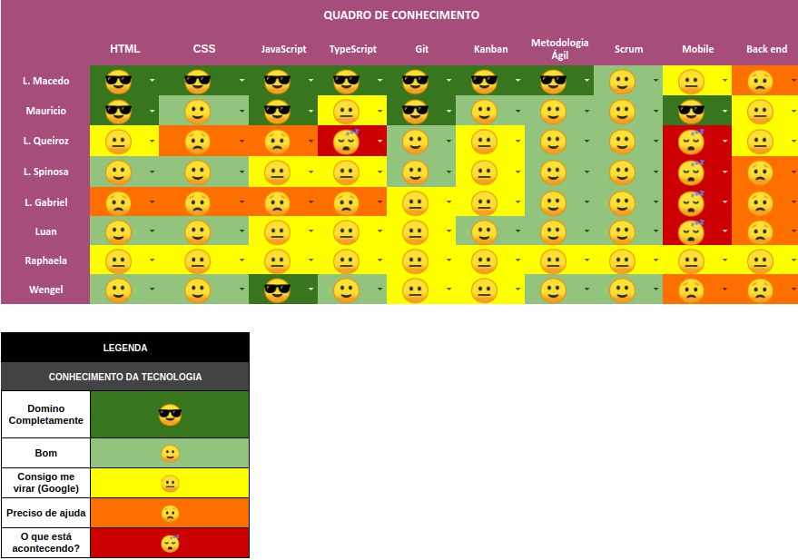

# Planning da Sprint 1

## 1. Visão Geral

| Início     | Fim        |
| ---------- | ---------- |
| 13/06/2022 | 21/06/2022 |

- Objetivo: Entender o dominio do projeto e amadurecer o entendimento do seu escopo. Também tivemos como objetivo familiarizar os membros com a metodologia Scrum e nossa integração como time.

## 2. Conclusão

| Issues | Descrição                          | Resposáveis                     | Status    |
| ------ | ---------------------------------- | ------------------------------- | --------- |
| ---    | Estudo de elementos do projeto     | Todos os integrantes            | Concluida |
| ---    | Configuração básica de ambiente    | Maurício Machado e Lucas Macedo | Concluida |
| ---    | Configuração do sistema operacinal | Todos os integrantes            | Conclída  |

## 3. Quadro de Conhecimento

## 4. Feedbacks

## Análise da Scrum Master

A equipe ainda está se adaptando ao inicio da matéria e aos membros serem considerados novos. A equipe se mostra animada e proativa, buscando aprender sobre as documentações e termos utilizados em aulas.
