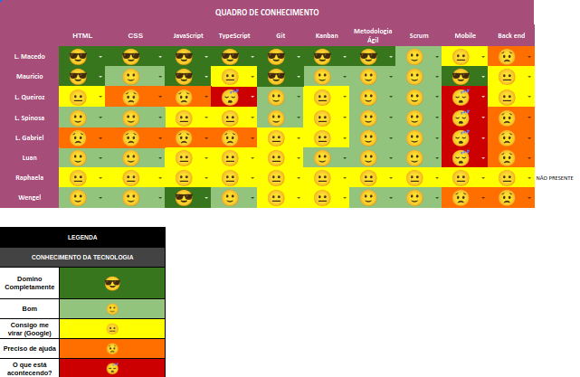

# Planning da Sprint 1

- Período : 02/09 a 07/09

- Objetivo: Entender o dominio do projeto e amadurecer o entendimento do seu escopo. Também tivemos como objetivo familiarizar os membros com a metodologia Scrum e nossa integração como time.

## Issues

| ID  | Descrição                             | Estimativa |
| --- | ------------------------------------- | ---------- |
| #18 | Criar protótipo de baixa fidelidade   | 5          |
| #20 | Definir as Tecnologias da Arquitetura | 8          |

- Total de pontos: 41pts.
- Total de pontos entregues: 31pts.

# Review

- Objetivo Alcançado? Sim. Os feedbacks da equipe demonstrou que estavamos alinhados a respeito do objetivo dessa sprint e que conseguimos cumprí - lo.

- Estimativa correta? A estimativa das issues não foram condigentes com seu real esforço. Em suma estimamos menos esforço do que foi necessário.

- Tarefas bem distribuidas? Não. As tarefas não foram bem distribuidas em MDS o que gerou um sobrecargo em alguns membros.

# Retrospectiva

## Pontos Positivos

- Comunuicação por issues
- Bom entendimento da solução a ser desenvolvida
- Gitflow posto em prática
- Bom uso do kanban

## Pontos Negativos

- Pouca proatividade(MDS)
- Membro sobrecarregado(Durval- MDS
- Desevolvedor Thiago não poderá ajudar a equipe
- Atraso paras as dailys

## Pontos de Melhoria

- Manter foco durante a daily
- Melhorar a comunicação entre MDS e Product Owner
- Melhorar as descrições das issues
- melhorar a organização de tarefas em grupo
- Não utilizar papel na Review e Retrospectiva

# Quadro de Conhecimento

## Análise da Scrum Master

A equipe ainda está se adaptando ao ritmo de trabalho então apesar de termos alcançado nosso objetivo os meios para tal foram em si bastante trabalhosos. A equipe se mostra animada mas pouco proátiva. Acredito que a falta de proátividade se dá pelo fator de toda metodologia de trabalho ser algo novo.
