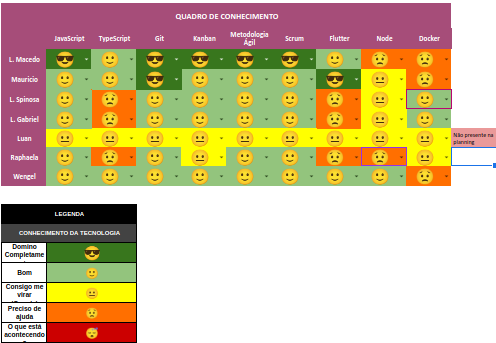

# Planning da Sprint 8

- Período : 08/08 a 12/08

**Objetivo:**

- Esta ultima sprint, atrasamos a data da planning. Por conta disso, a sprint 11 ficou curta em relação a outra
- Revisar tudo e preparar para a entrega
- Subir o aplicativo para a Google Play

## Issues

| ID  | Descrição | Estimativa | Responsável | OBS |
| --- | --------- | ---------- | ----------- | --- |
| #-- | --        | --         | --          | --  |

- Total de pontos: -- pontos

### Dívidas técnicas alocadas

Dívidas técnicas repontuadas

| ID   | Descrição             | Estimativa               |
| ---- | --------------------- | ------------------------ |
| #160 | [DOCS] - Rewrite docs | Até o final da sprint 10 |

# Retropectiva

- _Não teve ninguém que escreveu sobre a retrospectiva_

# Review

- Objetivo Alcançado? Objetivo foi bem alcançado para todos

- Estimativa correta? Sim, todos tiveram pontos para realizar

- Tarefas bem distribuidas? Sim, todos estiveram com algo para ajudar

# Quadro de Conhecimento

