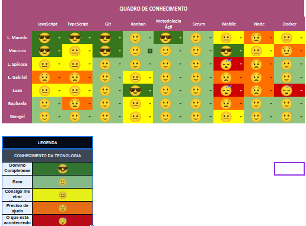

# Planning da Sprint 3

- Período : 12/07 a 18/07

- Objetivo: Realizar a confecção de documentos referentes a para entrega da release 1

## Issues

| ID  | Descrição                                     | Estimativa | Responsável                          | OBS                                                                                                                               |
| --- | --------------------------------------------- | ---------- | ------------------------------------ | --------------------------------------------------------------------------------------------------------------------------------- |
| #-- | Escrever historias de usuarios                | 8          | Mauricio                             | Escrever historia de usuario                                                                                                      |
| #-- | Pesquisar sobre documento de arquitetura      | 5          | Rapha, L.Gabriel e Mauricio(Suporte) | Pesquisar sobre modelos de documentos de arquitetura e mostrar para o grupo sobre o que foi pesquisado para entrarmos em consenso |
| #-- | Escrever sobre documento de arquitetura       | 21         | Milestone                            | ---                                                                                                                               |
| #-- | Protótipo de média fidelidade                 | 8          | L.Macedo e Luan                      | ---                                                                                                                               |
| #-- | Protótipo de alta fidelidade                  | 8          | Milestone                            | ---                                                                                                                               |
| #-- | Criação de guia de estilo e identidade visual | 8          | Wengel e Luan                        | Prazo de entrega: 25/07                                                                                                           |

- Total de pontos: 58pts.

### Dívidas técnicas alocadas

Dívidas técnicas repontuadas

| ID  | Descrição                | Estimativa |
| --- | ------------------------ | ---------- |
| #18 | Criar documento de visão | 1          |

# Retrospectiva

# Review

- Objetivo Alcançado? Objetivo foi alcançado, onde pendencias foram validadas durante a review

- Tarefas bem distribuidas? Sim, todos estiveram com algo para fazer

# Quadro de Conhecimento

