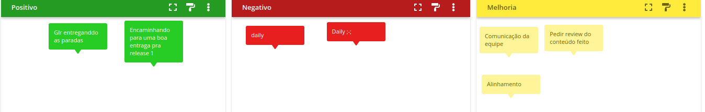
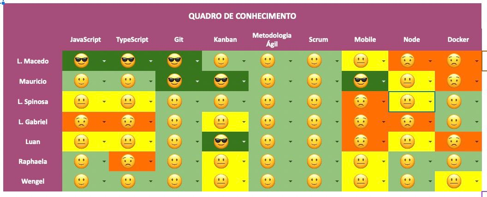

# Planning da Sprint 4

- Período : 19/07 a 25/07

**Objetivo:**

- Continuar com pontos de entrega para release 1
- Começar a escrita do codigo base
- Conversa sobre horarios que estão chocando as dailys
- Decidir o uso do web scraller
- Definir o documento de arquitetura

## Issues

| ID  | Descrição                                   | Estimativa | Responsável                                          | OBS                                                                            |
| --- | ------------------------------------------- | ---------- | ---------------------------------------------------- | ------------------------------------------------------------------------------ |
| #91 | Escrever sobre documento de arquitetura     | 13         | Mauricio Machado e Lucas Macedo                      | ---                                                                            |
| #92 | Escrita do documento de viabilidade tecnica | 3          | Lucas Spinosa                                        | ---                                                                            |
| #50 | Criar guia de estilo e identidade visual    | 8          | Luan Melo, Wengel Rodrigues e Lucas Spinosa(Suporte) | ---                                                                            |
| #56 | EP01-F01-US02-Registration Form             | 8          | Lucas Macedo, Raphaela Guimaraes e Lucas Gabriel     | Criar o usuario e armazenar em banco de dados; Criar a tela basica de registro |

- Total de pontos: 37

### Dívidas técnicas alocadas

Dívidas técnicas repontuadas

| ID  | Descrição                                     | Estimativa        |
| --- | --------------------------------------------- | ----------------- |
| #50 | Criação de guia de estilo e identidade visual | Final da sprint 4 |

# Retropectiva

# Review

- Objetivo Alcançado? O objetivo foi alcançado, porém, a daily continua com horário impactando os membros. Com isso, o time está realizando as dailys escritas quando não consegue se reunir no horário.
  Realizamos a validação dos documentos de identidade visual, guia de estilo e documento de arquitetura

- Estimativa correta? A estimativa de pontos ficou bem distribuida para os membros

- Tarefas bem distribuidas? As tarefas foram bem distribuidas para os membros

# Quadro de Conhecimento

