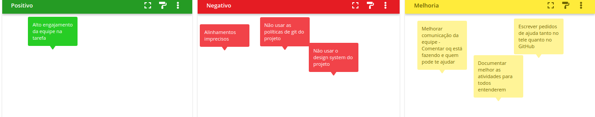
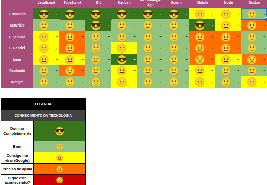

# Planning da Sprint 5

- Período : 26/07 a 01/08

**Objetivo:**

- Reunir o time para validar guia de estilo e identidade visual
- Apresentar o documento de arquitetura ao time
- Continuar com a confecção dos pontos de entrega para release 1
- Avaliar o restante dos documentos que temos
- O time ficou de revisar requisitos funcionais e não funcionais

## Issues

| ID   | Descrição                                     | Estimativa | Responsável                                                                                                        | OBS                                                                                                                                   |
| ---- | --------------------------------------------- | ---------- | ------------------------------------------------------------------------------------------------------------------ | ------------------------------------------------------------------------------------------------------------------------------------- |
| #56  | EP01-F01-US02-Registration Form               | 8          | Lucas Spinosa, Raphaela Guimaraes e Lucas Gabriel(Back-end)/ Lucas Macedo, Luan Melo e Wengel Rogrigues(Front-end) | Para o back end: Fazer o registro do formulário e registrar no back; Para o front: criar a página de formulário de registro           |
| #101 | Criar protótipo de página de login e registro | 5          | Luan Melo e Wengel Rogrigues                                                                                       | Fazer o protótipo página de login, registro                                                                                           |
| #100 | Criar protótipo de página de Splash Pages     | 3          | Luan Melo e Wengel Rogrigues                                                                                       | Fazer o protótipo página de Splash Pages                                                                                              |
| #99  | Desenvolver o splash pages app                | 3          | Lucas Macedo, Wengel Rogrigues e Lucas Gabriel                                                                     | Para o time do front: Realizar a criação de splash pages para o College Flow (telas inicial do aplicativo), não necessita de back end |

- Total de pontos: 19

### Dívidas técnicas alocadas

Dívidas técnicas repontuadas

| ID  | Descrição                       | Estimativa        |
| --- | ------------------------------- | ----------------- |
| #56 | EP01-F01-US02-Registration Form | Final da sprint 5 |

# Retropectiva

# Review

- Objetivo Alcançado? O objetivo da sprint foi alcançado, onde tiveram algumas pequenas dívidas técnicas

- Estimativa correta? Teve uma quantidade boa de pontos para a sprint, de forma que nao deixou ninguem sobrecarregado

- Tarefas bem distribuidas? Sim, todos do grupo obtiveram alguma atividade para realizar

# Quadro de Conhecimento

