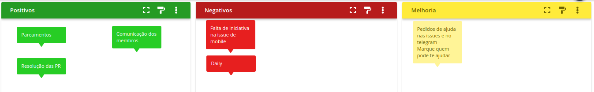

# Planning da Sprint 6

- Período : 02/08 a 08/08

**Objetivo:**

- Terminar o feature 01
- Resolver os problemas apresentados pela professora na entrega da release 01
- Estudar sobre possíveis conflitos de código

## Issues

| ID   | Descrição                        | Estimativa | Responsável    | OBS                                                                                                                                         |
| ---- | -------------------------------- | ---------- | -------------- | ------------------------------------------------------------------------------------------------------------------------------------------- |
| #114 | Resolver feedbacks da release 01 | 21         | Todos do grupo | Essa issue foi destinada para resolver os feedbacks dados pela professora. Essa issue considera pai, abrange as suas possíveis dependências |

- Total de pontos: 21 pontos

### Dívidas técnicas alocadas

Dívidas técnicas repontuadas

| ID  | Descrição                           | Estimativa               |
| --- | ----------------------------------- | ------------------------ |
| #56 | Integrar o back end com o front end | Até o final da sprint 07 |

- A issue #56 ficou com peso menor do que deveria, portanto, teva alguns debitos

# Retropectiva

- Pontos de melhorias: Melhorar a comunicação do time como um todo

# Review

- Objetivo Alcançado? Mesmo não tendo realizado a implementação do código durante essa sprint, o objetivo de organizar o repositorio foi alcançado.

- Estimativa correta? A estimativa para as tarefas de organização foram alcançadas e superadas.

- Tarefas bem distribuidas? Por conta de não termos o front ainda integrado com o back-end, as tarefas referentes ao epico 01, tivemos que deixar as tarefas de registro em Icebox. Devido a isso, estamos implementando outro epico para avançarmos no projeto

# Quadro de Conhecimento

