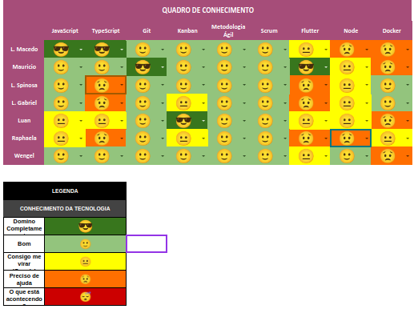

# Planning da Sprint 6

- Período : 09/08 a 15/08

**Objetivo:**

- Realizar a integração do back-end com o front-end, de forma que consigamos utilizar as funções do aplicativo, realizando esse débito técnico de sprint 5
- Começar com o desenvolvimento do epico de listar cursos e matérias

## Issues

| ID  | Descrição                                 | Estimativa | Responsável | OBS                                                                                                    |
| --- | ----------------------------------------- | ---------- | ----------- | ------------------------------------------------------------------------------------------------------ |
| #64 | EP02-F02-US01 - List Courses and Subjects | ---        | ----        | A descrição está localizado na [Issue do github](https://github.com/fga-eps-mds/CollegeFlow/issues/64) |
| #90 |                                           | ---        | ----        | A descrição está localizado na [Issue do github]()                                                     |
| #56 |                                           | ---        | ----        | A descrição está localizado na [Issue do github]()                                                     |

- Total de pontos: xx pontos

### Dívidas técnicas alocadas

Dívidas técnicas repontuadas

| ID  | Descrição | Estimativa |
| --- | --------- | ---------- |
| #-- | --        | ---        |

# Retropectiva

- Pontos de melhorias: Melhorar a comunicação do time como um todo

# Review

- Objetivo Alcançado?

- Estimativa correta?

- Tarefas bem distribuidas?

# Quadro de Conhecimento

