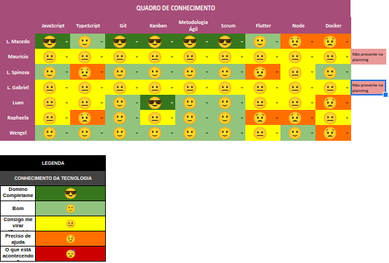

# Planning da Sprint 8

- Período : 19/08 a 22/08

**Objetivo:**

- Começar com o desenvolvimento do epico relacionado as reviews.
- Continuar com o login de usuarios para acesso no aplicativo.
- Mapear possiveis softwares que oferecem testes automatizados e implementar no projeto.
- Preencher e registrar dados do webscrawler no mongo

## Issues

| ID  | Descrição                       | Estimativa | Responsável                     | OBS                                                                                                                                               |
| --- | ------------------------------- | ---------- | ------------------------------- | ------------------------------------------------------------------------------------------------------------------------------------------------- |
| #57 | EP01-F01-US03 - Student Form    | 5 pontos   | Mauricio                        | Continuar com o registro de estudante ao logar                                                                                                    |
| #71 | EP02-F03-US06 - List of Reviews | 5 pontos   | Rapha e L. Macedo               | Para o front, começar com a exibição da lista de reviews. Para o back, criar os atributos das listas                                              |
| #83 | EP05-F01-US01 - Review Form     | 5 pontos   | L. Spinosa, L. Gabriel e Wengel | Para o front, criar a tela de registro de reviews com base no prototipo. Para o back, realizar a criação de reviews e armazenar no banco de dados |

- Total de pontos: 20 pontos

### Dívidas técnicas alocadas

Dívidas técnicas repontuadas

| ID  | Descrição                                           | Estimativa            |
| --- | --------------------------------------------------- | --------------------- |
| #64 | EP02-F02-US01 - List Courses and Subjects(Back-end) | Ate o final de semana |

# Retropectiva

# Review

- Objetivo Alcançado?

- Estimativa correta?

- Tarefas bem distribuidas?

# Quadro de Conhecimento

