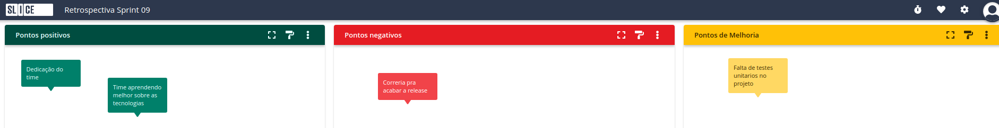

# Planning da Sprint 9

- Período : 23/08 a 29/08

**Objetivo:**

- Realizar os gets e posts das reviews no back end
- Utilizar os dados do back no front end
- Efetuar os testes dos repositorios
- Conversar sobre a nova proposta do aplicativo, onde reduzimos bastante o escopo do projeto para conseguirmos entregar com qualidade ao final

## Issues

| ID   | Descrição                                                | Estimativa | Responsável             | OBS                                                                                               |
| ---- | -------------------------------------------------------- | ---------- | ----------------------- | ------------------------------------------------------------------------------------------------- |
| #134 | FEAT: Implements Automatizate Tests on projcts           | 5 pontos   | Raphaela e L. Macedo    | A descrição esta localizada na issue [134](https://github.com/fga-eps-mds/CollegeFlow/issues/134) |
| #89  | EP07-F01-US01 - Search Functionality                     | 5 pontos   | Wengel e Luan           | A descrição esta localizada na issue [89](https://github.com/fga-eps-mds/CollegeFlow/issues/89)   |
| #147 | [FEAT]-Create methods on backend                         | 5 pontos   | L. Spinosa e L. Gabriel | A descrição esta localizada na issue [147](https://github.com/fga-eps-mds/CollegeFlow/issues/147) |
| #151 | [FEAT] - IShow subjects on mobile                        | 5 pontos   | Mauricio Machado        | A descrição esta localizada na issue [151](https://github.com/fga-eps-mds/CollegeFlow/issues/151) |
| #149 | [STUDY] - Study how to put the aplication on google play | 3 pontos   | Wengel                  | A descrição esta localizada na issue [149](https://github.com/fga-eps-mds/CollegeFlow/issues/149) |

- Total de pontos: 23 pontos

### Dívidas técnicas alocadas

Dívidas técnicas repontuadas

| ID  | Descrição | Estimativa |
| --- | --------- | ---------- |
| #-- | --        | --         |

# Retropectiva

# Review

- Objetivo Alcançado? Não, o front end ainda não está utilizando recursos do back end nem suas funções. Isso ocorreu pela má organização do time como um todo, faltando comunicação e planejamento necessário

- Estimativa correta? A estimativa de pontos ficou a baixo do comum, porém, como a ultima semana teve diversos impedimentos do time, não conseguimos atender a expectativa

- Tarefas bem distribuidas? Sim, todos ficaram com pelo menos uma tarefa no trabalho

# Quadro de Conhecimento

